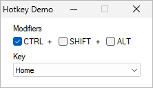

A simple demo program of the [RegisterHotKey](https://learn.microsoft.com/en-us/windows/win32/api/winuser/nf-winuser-registerhotkey) API function that I wrote many years ago in VB.NET. I found the project code on an old flash drive, dusted it, tidied up the code and uploaded it here. The program will make an audible beep when the chosen hotkey is pressed.

